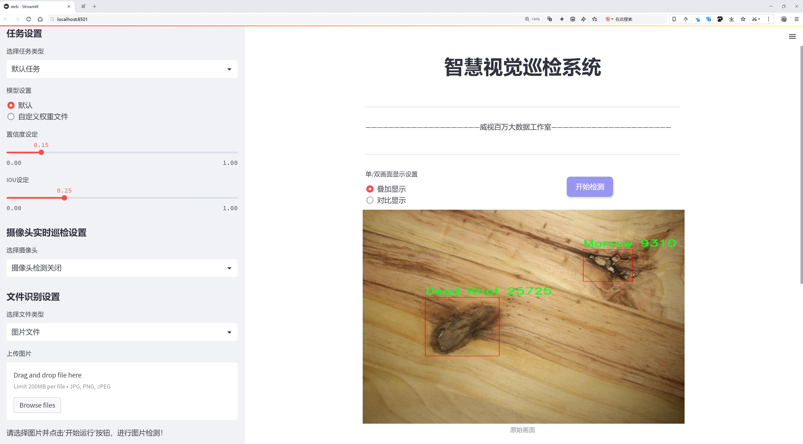
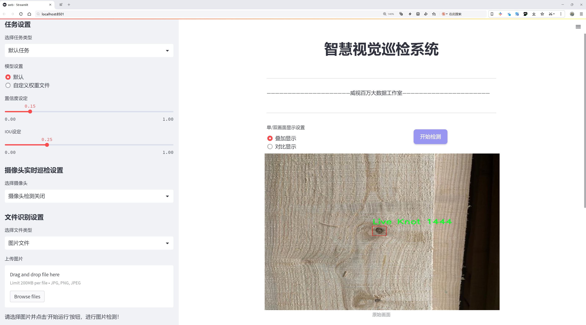
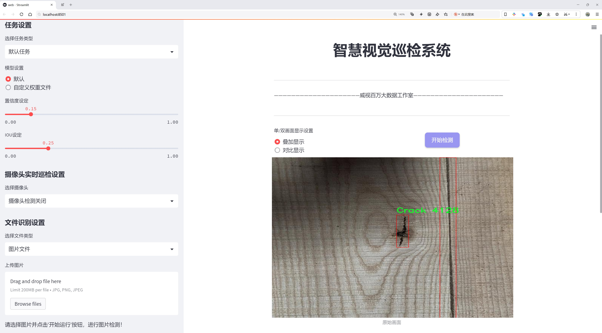
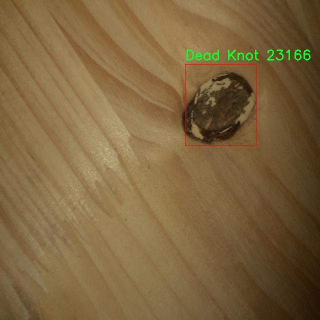
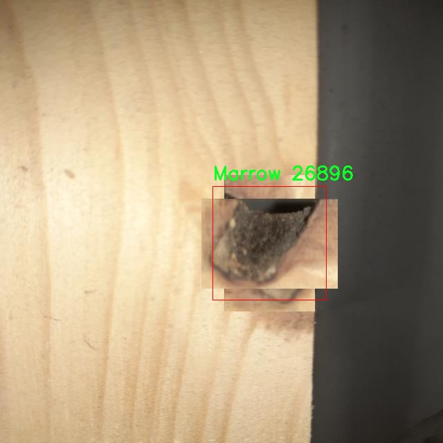
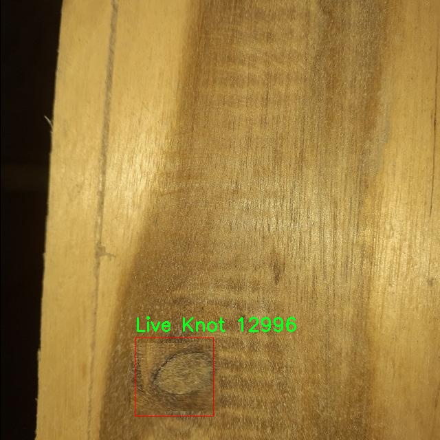
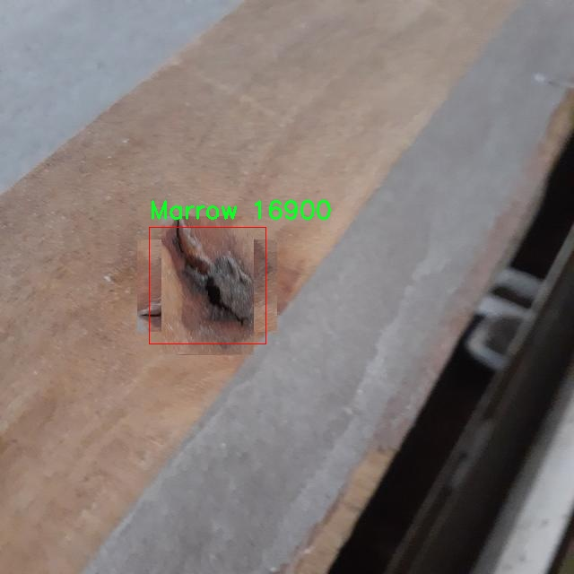
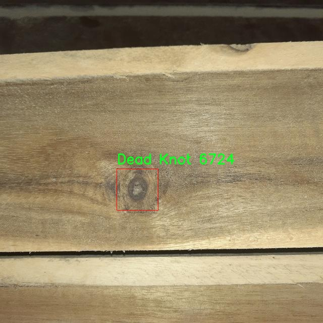

# 木材缺陷检测检测系统源码分享
 # [一条龙教学YOLOV8标注好的数据集一键训练_70+全套改进创新点发刊_Web前端展示]

### 1.研究背景与意义

项目参考[AAAI Association for the Advancement of Artificial Intelligence](https://gitee.com/qunmasj/projects)

项目来源[AACV Association for the Advancement of Computer Vision](https://github.com/qunshansj/good)

研究背景与意义

随着全球木材产业的迅速发展，木材作为一种重要的建筑和家具材料，其质量直接影响到产品的安全性和使用寿命。然而，木材在生长过程中容易受到多种自然因素的影响，导致其出现各种缺陷，如裂纹、死节、活节和髓心等。这些缺陷不仅降低了木材的美观性和结构强度，还可能导致在后续加工和使用过程中出现安全隐患。因此，如何高效、准确地检测木材缺陷，成为了木材加工行业亟待解决的关键问题。

传统的木材缺陷检测方法主要依赖人工视觉检查和简单的机械检测。这些方法不仅耗时耗力，而且容易受到人为因素的影响，导致检测结果的不准确性和不一致性。随着计算机视觉和深度学习技术的快速发展，基于图像处理的自动化检测方法逐渐成为研究的热点。尤其是YOLO（You Only Look Once）系列目标检测算法，以其高效性和实时性，已被广泛应用于各类物体检测任务中。YOLOv8作为该系列的最新版本，具备了更强的特征提取能力和更快的推理速度，为木材缺陷检测提供了新的技术路径。

本研究旨在基于改进的YOLOv8算法，构建一个高效的木材缺陷检测系统。通过对5691张包含四类木材缺陷（裂纹、死节、活节和髓心）的图像进行训练和测试，我们期望能够实现对木材缺陷的快速、准确识别。数据集的丰富性和多样性为模型的训练提供了良好的基础，使得系统在实际应用中能够具备较强的泛化能力和鲁棒性。

本研究的意义不仅在于技术层面的创新，更在于其对木材行业的实际应用价值。通过引入先进的深度学习技术，能够大幅提高木材缺陷检测的效率和准确性，从而降低人工成本和误判率。此外，自动化检测系统的应用将推动木材加工行业的智能化转型，提升整体生产效率和产品质量，促进可持续发展。

综上所述，基于改进YOLOv8的木材缺陷检测系统的研究，不仅填补了木材检测领域的技术空白，也为相关行业提供了切实可行的解决方案。未来，随着技术的不断进步和数据集的进一步丰富，该系统有望在更广泛的木材检测场景中得到应用，为木材产业的健康发展贡献力量。

### 2.图片演示







##### 注意：由于此博客编辑较早，上面“2.图片演示”和“3.视频演示”展示的系统图片或者视频可能为老版本，新版本在老版本的基础上升级如下：（实际效果以升级的新版本为准）

  （1）适配了YOLOV8的“目标检测”模型和“实例分割”模型，通过加载相应的权重（.pt）文件即可自适应加载模型。

  （2）支持“图片识别”、“视频识别”、“摄像头实时识别”三种识别模式。

  （3）支持“图片识别”、“视频识别”、“摄像头实时识别”三种识别结果保存导出，解决手动导出（容易卡顿出现爆内存）存在的问题，识别完自动保存结果并导出到tempDir中。

  （4）支持Web前端系统中的标题、背景图等自定义修改，后面提供修改教程。

  另外本项目提供训练的数据集和训练教程,暂不提供权重文件（best.pt）,需要您按照教程进行训练后实现图片演示和Web前端界面演示的效果。

### 3.视频演示

[3.1 视频演示](https://www.bilibili.com/video/BV1HrHWeUEu9/?vd_source=ff015de2d29cbe2a9cdbfa7064407a08)

### 4.数据集信息展示

##### 4.1 本项目数据集详细数据（类别数＆类别名）

nc: 4
names: ['Crack', 'Dead Knot', 'Live Knot', 'Marrow']


##### 4.2 本项目数据集信息介绍

数据集信息展示

在木材缺陷检测领域，准确识别和分类木材表面的缺陷对于提高木材加工和利用效率至关重要。本研究所使用的数据集名为“Wood Defects”，专门用于训练和改进YOLOv8模型，以实现对木材缺陷的高效检测和分类。该数据集包含四个主要类别，分别是“Crack”（裂缝）、“Dead Knot”（死结）、“Live Knot”（活结）和“Marrow”（髓心），这些类别涵盖了木材在自然生长和加工过程中可能出现的主要缺陷。

数据集的构建经过精心设计，旨在提供丰富的样本和多样化的缺陷表现，以确保模型在实际应用中的鲁棒性和准确性。每个类别的样本均经过精细标注，确保在训练过程中模型能够学习到每种缺陷的特征和差异。例如，裂缝通常表现为木材表面的线状缺陷，可能会因环境因素或内部应力而形成；而死结和活结则是木材生长过程中形成的结疤，前者通常是由于树木死亡后形成的，而后者则是活树中正常生长的部分。髓心则是木材中心的部分，通常在木材的质量评估中也需要考虑其对整体结构的影响。

在数据集的构建过程中，研究团队采用了多种采集手段，确保涵盖不同种类和不同生长环境下的木材样本。这种多样性不仅增强了数据集的代表性，也为YOLOv8模型的训练提供了更为广泛的学习基础。通过对不同光照、角度和背景下的木材缺陷进行拍摄，数据集有效地模拟了实际应用场景中的复杂性，使得训练出的模型能够更好地适应各种环境条件。

此外，为了提高模型的泛化能力，数据集还进行了数据增强处理，包括旋转、缩放、裁剪和颜色变换等操作。这些技术手段的应用，不仅增加了训练样本的数量，还有效提升了模型对木材缺陷的识别能力。通过这种方式，YOLOv8模型在面对未见过的样本时，能够更好地进行推理和分类，从而提高检测的准确性和可靠性。

总之，“Wood Defects”数据集为改进YOLOv8的木材缺陷检测系统提供了坚实的基础。通过对四个主要缺陷类别的深入研究和多样化样本的构建，研究团队希望能够推动木材加工行业的智能化发展，提升木材资源的利用效率和产品质量。随着机器学习和计算机视觉技术的不断进步，未来的木材缺陷检测系统将更加智能化、自动化，为行业带来更多的创新和变革。











### 5.全套项目环境部署视频教程（零基础手把手教学）

[5.1 环境部署教程链接（零基础手把手教学）](https://www.ixigua.com/7404473917358506534?logTag=c807d0cbc21c0ef59de5)


[5.2 安装Python虚拟环境创建和依赖库安装视频教程链接（零基础手把手教学）](https://www.ixigua.com/7404474678003106304?logTag=1f1041108cd1f708b01a)

### 6.手把手YOLOV8训练视频教程（零基础小白有手就能学会）

[6.1 环境部署教程链接（零基础手把手教学）](https://www.ixigua.com/7404477157818401292?logTag=d31a2dfd1983c9668658)

### 7.70+种全套YOLOV8创新点代码加载调参视频教程（一键加载写好的改进模型的配置文件）

[7.1 环境部署教程链接（零基础手把手教学）](https://www.ixigua.com/7404478314661806627?logTag=29066f8288e3f4eea3a4)

### 8.70+种全套YOLOV8创新点原理讲解（非科班也可以轻松写刊发刊，V10版本正在科研待更新）

由于篇幅限制，每个创新点的具体原理讲解就不一一展开，具体见下列网址中的创新点对应子项目的技术原理博客网址【Blog】：


[8.1 70+种全套YOLOV8创新点原理讲解链接](https://gitee.com/qunmasj/good)

### 9.系统功能展示（检测对象为举例，实际内容以本项目数据集为准）

图9.1.系统支持检测结果表格显示

  图9.2.系统支持置信度和IOU阈值手动调节

  图9.3.系统支持自定义加载权重文件best.pt(需要你通过步骤5中训练获得)

  图9.4.系统支持摄像头实时识别

  图9.5.系统支持图片识别

  图9.6.系统支持视频识别

  图9.7.系统支持识别结果文件自动保存

  图9.8.系统支持Excel导出检测结果数据


### 10.原始YOLOV8算法原理

原始YOLOv8算法原理

YOLOv8算法是由Ultralytics公司于2023年1月10日推出的最新版本，它在YOLOv7的基础上进行了显著的改进和优化，代表了目标检测领域的一次重要进步。YOLO系列算法自问世以来，一直以其高效的目标检测能力和实时性而受到广泛关注，而YOLOv8则在此基础上，进一步提升了检测精度和速度，成为当前最为先进的目标检测算法之一。

YOLOv8采用了一种更深的卷积神经网络结构，这种基于卷积神经网络的设计理念使得整个图像可以作为输入，直接在图像上进行目标检测和定位。这一方法的核心在于避免了传统目标检测算法中常用的滑动窗口或区域提议方法，从而显著提高了检测的精度和速度。YOLOv8的设计不仅关注算法的准确性，还特别注重在各种复杂场景下的适应性，例如智能监控、自动驾驶和人脸识别等应用场景。

在YOLOv8的实现中，算法引入了多尺度训练和测试的技术，这使得模型能够在不同尺度的特征图上进行训练，从而提高了对各种尺寸目标的检测能力。此外，特征金字塔网络（FPN）的应用进一步增强了模型对多尺度目标的感知能力，确保了在复杂背景下的目标检测性能。这种特征融合的策略，使得YOLOv8在处理小目标时表现得更加出色，尽管在某些复杂环境下仍可能面临定位误差和目标感知能力不足的问题。

YOLOv8的网络结构主要由四个模块组成：输入端、主干网络、Neck端和输出端。输入端通过Mosaic数据增强、自适应图片缩放和灰度填充等方式对输入图像进行预处理，确保模型能够接收到高质量的输入数据。主干网络则采用了一系列卷积、池化等操作，通过C2模块和SPPF模块提取图像特征，形成高维特征表示。这一过程不仅提高了特征提取的效率，还通过残差连接和瓶颈结构减小了网络的复杂度，提升了模型的性能。

在Neck端，YOLOv8采用了基于路径聚合网络（PAN）的结构，通过上采样、下采样和特征拼接等方式，将来自主干网络不同阶段的特征图进行融合。这一设计使得模型能够更好地捕捉不同尺度目标的信息，从而提高了目标检测的性能和鲁棒性。Neck端的多尺度特征融合技术是YOLOv8的一大亮点，它有效地增强了模型对复杂场景中目标的识别能力。

输出端则负责最终的目标检测和分类任务。YOLOv8采用了解耦头（decoupled head）结构，将分类和回归过程分开进行处理。这一设计不仅提高了模型的灵活性，还使得正负样本的匹配和损失计算变得更加高效。YOLOv8使用Task-Aligned Assigner方法，对分类分数和回归分数进行加权，从而实现更为精准的样本匹配。损失计算方面，YOLOv8结合了二元交叉熵（BCE）和分布焦点损失（DFL）等多种损失函数，确保了模型在训练过程中的稳定性和准确性。

值得一提的是，YOLOv8的网络结构包括五种不同的变体，分别为YOLOv8n、YOLOv8s、YOLOv8m、YOLOv8l和YOLOv8x。这些变体的主要区别在于主干网络中卷积层的数量和残差块的数目不同，但它们的基本原理和设计思想是一致的。这种多样化的网络结构使得YOLOv8能够在不同的应用场景中灵活适应，满足不同用户的需求。

尽管YOLOv8在许多方面表现出色，但在某些复杂环境下，例如水面环境中的小目标漂浮物检测，仍然存在一些挑战。为了进一步提升YOLOv8的性能，研究者们提出了YOLOv8-WSSOD算法，旨在解决定位误差和目标感知能力不足的问题。该改进算法通过引入BiFormer双层路由注意力机制，构建C2fBF模块，保留特征提取过程中更细粒度的上下文信息，从而减轻主干网络下采样过程中的噪声影响。此外，针对小目标漏检问题，YOLOv8-WSSOD还添加了更小的检测头，以提升网络对小目标的感知能力，并在Neck端引入GSConv和Slim-neck技术，以保持精度并降低计算量。

综上所述，YOLOv8算法通过深度卷积神经网络的设计、特征金字塔网络的应用以及多尺度特征融合等技术手段，极大地提升了目标检测的精度和速度。尽管在某些复杂环境下仍存在挑战，但其在智能监控、自动驾驶和人脸识别等领域的广泛应用潜力，使得YOLOv8成为当前目标检测领域的重要工具。随着后续研究的深入，YOLOv8及其改进版本有望在更广泛的应用场景中展现出更为卓越的性能。


### 11.项目核心源码讲解（再也不用担心看不懂代码逻辑）

#### 11.1 ultralytics\models\fastsam\predict.py

以下是对代码的核心部分进行分析和详细注释的结果：

```python
# 导入必要的库
import torch
from ultralytics.engine.results import Results
from ultralytics.models.fastsam.utils import bbox_iou
from ultralytics.models.yolo.detect.predict import DetectionPredictor
from ultralytics.utils import DEFAULT_CFG, ops

class FastSAMPredictor(DetectionPredictor):
    """
    FastSAMPredictor类专门用于在Ultralytics YOLO框架中进行快速SAM（Segment Anything Model）分割预测任务。

    该类扩展了DetectionPredictor，定制了预测管道，特别针对快速SAM进行了调整。
    它调整了后处理步骤，以结合掩码预测和非最大抑制，同时优化单类分割。

    属性:
        cfg (dict): 预测的配置参数。
        overrides (dict, optional): 可选的参数覆盖，用于自定义行为。
        _callbacks (dict, optional): 可选的回调函数列表，在预测过程中调用。
    """

    def __init__(self, cfg=DEFAULT_CFG, overrides=None, _callbacks=None):
        """
        初始化FastSAMPredictor类，继承自DetectionPredictor并将任务设置为'segment'。

        参数:
            cfg (dict): 预测的配置参数。
            overrides (dict, optional): 可选的参数覆盖，用于自定义行为。
            _callbacks (dict, optional): 可选的回调函数列表，在预测过程中调用。
        """
        super().__init__(cfg, overrides, _callbacks)  # 调用父类构造函数
        self.args.task = "segment"  # 设置任务为分割

    def postprocess(self, preds, img, orig_imgs):
        """
        对预测结果进行后处理，包括非最大抑制和将框缩放到原始图像大小，并返回最终结果。

        参数:
            preds (list): 模型的原始输出预测。
            img (torch.Tensor): 处理后的图像张量。
            orig_imgs (list | torch.Tensor): 原始图像或图像列表。

        返回:
            (list): 包含处理后的框、掩码和其他元数据的Results对象列表。
        """
        # 执行非最大抑制，过滤掉重叠的框
        p = ops.non_max_suppression(
            preds[0],
            self.args.conf,  # 置信度阈值
            self.args.iou,  # IOU阈值
            agnostic=self.args.agnostic_nms,  # 是否类别无关
            max_det=self.args.max_det,  # 最大检测数量
            nc=1,  # 设置为1类，因为SAM没有类别预测
            classes=self.args.classes,  # 指定类别
        )

        # 创建一个全框，初始化为零
        full_box = torch.zeros(p[0].shape[1], device=p[0].device)
        full_box[2], full_box[3], full_box[4], full_box[6:] = img.shape[3], img.shape[2], 1.0, 1.0
        full_box = full_box.view(1, -1)  # 调整形状为(1, -1)

        # 计算与全框的IOU，并找到满足阈值的索引
        critical_iou_index = bbox_iou(full_box[0][:4], p[0][:, :4], iou_thres=0.9, image_shape=img.shape[2:])
        if critical_iou_index.numel() != 0:  # 如果找到满足条件的框
            full_box[0][4] = p[0][critical_iou_index][:, 4]  # 更新置信度
            full_box[0][6:] = p[0][critical_iou_index][:, 6:]  # 更新其他信息
            p[0][critical_iou_index] = full_box  # 替换原始框

        # 如果输入图像是张量而不是列表，则转换为numpy格式
        if not isinstance(orig_imgs, list):
            orig_imgs = ops.convert_torch2numpy_batch(orig_imgs)

        results = []  # 初始化结果列表
        proto = preds[1][-1] if len(preds[1]) == 3 else preds[1]  # 获取掩码原型

        # 遍历每个预测结果
        for i, pred in enumerate(p):
            orig_img = orig_imgs[i]  # 获取原始图像
            img_path = self.batch[0][i]  # 获取图像路径
            if not len(pred):  # 如果没有检测到框
                masks = None  # 掩码为None
            elif self.args.retina_masks:  # 如果使用Retina掩码
                pred[:, :4] = ops.scale_boxes(img.shape[2:], pred[:, :4], orig_img.shape)  # 缩放框
                masks = ops.process_mask_native(proto[i], pred[:, 6:], pred[:, :4], orig_img.shape[:2])  # 处理掩码
            else:  # 否则使用常规掩码处理
                masks = ops.process_mask(proto[i], pred[:, 6:], pred[:, :4], img.shape[2:], upsample=True)  # 处理掩码
                pred[:, :4] = ops.scale_boxes(img.shape[2:], pred[:, :4], orig_img.shape)  # 缩放框

            # 将结果添加到结果列表中
            results.append(Results(orig_img, path=img_path, names=self.model.names, boxes=pred[:, :6], masks=masks))
        
        return results  # 返回处理后的结果列表
```

### 代码核心部分分析
1. **类定义**：`FastSAMPredictor` 继承自 `DetectionPredictor`，专门用于快速的分割任务。
2. **初始化方法**：设置任务为分割，并调用父类的初始化方法。
3. **后处理方法**：主要负责对模型的输出进行后处理，包括非最大抑制、框的缩放、掩码的处理等。
4. **IOU计算**：使用 `bbox_iou` 函数计算与全框的IOU，以筛选出有效的检测结果。
5. **结果整理**：将处理后的结果封装成 `Results` 对象，便于后续使用。

通过以上分析和注释，可以更清晰地理解代码的功能和实现细节。

该文件是Ultralytics YOLO框架中的一个预测模块，专门用于快速的SAM（Segment Anything Model）分割预测任务。文件中定义了一个名为`FastSAMPredictor`的类，它继承自`DetectionPredictor`，并针对快速SAM进行了定制化的预测流程。

在类的初始化方法中，`FastSAMPredictor`接收配置参数、可选的参数覆盖和回调函数列表。初始化时，它调用父类的构造函数，并将任务类型设置为“segment”，表明该类的主要功能是进行图像分割。

类中最重要的方法是`postprocess`，该方法负责对模型的原始输出进行后处理，包括非极大值抑制（NMS）和将边界框缩放到原始图像大小。该方法的输入包括模型的原始预测结果、处理后的图像张量以及原始图像。首先，使用`ops.non_max_suppression`对预测结果进行非极大值抑制，以减少重叠的边界框。由于SAM模型没有类别预测，因此这里将类别数设置为1。

接下来，构造一个全框（`full_box`），并根据输入图像的尺寸调整其形状。通过计算与全框的IoU（Intersection over Union），找到与之重叠度高于0.9的预测框，并更新全框的相关信息。之后，检查输入的原始图像是否为列表，如果不是，则将其转换为numpy格式。

在处理每个预测时，若预测结果为空，则设置掩码为None；如果需要返回细节掩码，则调用不同的处理函数来生成掩码。最终，将处理后的结果封装为`Results`对象，并返回包含所有结果的列表。

整体来看，该文件的功能是将YOLO框架中的检测预测扩展为适用于快速SAM的分割预测，优化了单类分割的后处理步骤，以便更好地适应图像分割任务的需求。

#### 11.2 ui.py

```python
import sys
import subprocess

def run_script(script_path):
    """
    使用当前 Python 环境运行指定的脚本。

    Args:
        script_path (str): 要运行的脚本路径

    Returns:
        None
    """
    # 获取当前 Python 解释器的路径
    python_path = sys.executable

    # 构建运行命令，使用 streamlit 运行指定的脚本
    command = f'"{python_path}" -m streamlit run "{script_path}"'

    # 执行命令
    result = subprocess.run(command, shell=True)
    # 检查命令执行的返回码，如果不为0则表示出错
    if result.returncode != 0:
        print("脚本运行出错。")

# 实例化并运行应用
if __name__ == "__main__":
    # 指定要运行的脚本路径
    script_path = "web.py"  # 假设脚本在当前目录下

    # 调用函数运行脚本
    run_script(script_path)
```

### 代码注释说明：

1. **导入模块**：
   - `sys`：用于访问与 Python 解释器紧密相关的变量和函数。
   - `subprocess`：用于执行外部命令和程序。

2. **`run_script` 函数**：
   - 定义一个函数 `run_script`，接收一个参数 `script_path`，表示要运行的脚本路径。
   - 使用 `sys.executable` 获取当前 Python 解释器的路径，以确保使用正确的 Python 环境来运行脚本。
   - 构建一个命令字符串，使用 `streamlit` 模块来运行指定的脚本。
   - 使用 `subprocess.run` 执行构建的命令，并通过 `shell=True` 允许在 shell 中执行命令。
   - 检查命令的返回码，如果返回码不为0，表示脚本运行出错，打印错误信息。

3. **主程序块**：
   - 使用 `if __name__ == "__main__":` 确保该代码块仅在脚本作为主程序运行时执行。
   - 指定要运行的脚本路径 `script_path`，假设脚本文件名为 `web.py`。
   - 调用 `run_script` 函数，传入脚本路径以执行该脚本。

这个程序文件的主要功能是通过当前的 Python 环境来运行一个指定的脚本，具体是一个名为 `web.py` 的文件。程序首先导入了必要的模块，包括 `sys`、`os` 和 `subprocess`，以及一个自定义的 `abs_path` 函数，用于获取文件的绝对路径。

在 `run_script` 函数中，首先获取当前 Python 解释器的路径，这样可以确保使用正确的 Python 环境来执行脚本。接着，构建一个命令字符串，这个命令使用 `streamlit` 来运行指定的脚本。`streamlit` 是一个用于构建数据应用的库，通常用于快速开发和展示数据可视化应用。

然后，使用 `subprocess.run` 方法来执行这个命令。该方法会在一个新的进程中运行命令，并等待其完成。如果脚本运行过程中出现错误，返回的状态码将不为零，此时程序会打印出“脚本运行出错”的提示信息。

在文件的最后部分，程序通过 `if __name__ == "__main__":` 语句来确保只有在直接运行该文件时才会执行下面的代码。在这里，指定了要运行的脚本路径，即 `web.py`，并调用 `run_script` 函数来执行这个脚本。

总体来说，这个程序的作用是简化通过 Python 环境运行特定脚本的过程，确保用户能够方便地启动 `web.py` 脚本。

#### 11.3 ultralytics\data\explorer\explorer.py

以下是代码中最核心的部分，并附上详细的中文注释：

```python
class Explorer:
    def __init__(self, data: Union[str, Path] = "coco128.yaml", model: str = "yolov8n.pt", uri: str = "~/ultralytics/explorer") -> None:
        # 初始化Explorer类，连接到LanceDB数据库，并加载YOLO模型
        self.connection = lancedb.connect(uri)  # 连接到LanceDB数据库
        self.table_name = Path(data).name.lower() + "_" + model.lower()  # 生成表名
        self.model = YOLO(model)  # 加载YOLO模型
        self.data = data  # 数据集路径
        self.choice_set = None  # 选择的数据集
        self.table = None  # 数据表
        self.progress = 0  # 进度

    def create_embeddings_table(self, force: bool = False, split: str = "train") -> None:
        """
        创建一个LanceDB表，包含数据集中图像的嵌入向量。
        如果表已存在且不强制覆盖，则重用该表。
        """
        if self.table is not None and not force:
            LOGGER.info("Table already exists. Reusing it. Pass force=True to overwrite it.")
            return
        
        # 检查数据集是否存在
        data_info = check_det_dataset(self.data)
        if split not in data_info:
            raise ValueError(f"Split {split} is not found in the dataset.")
        
        choice_set = data_info[split]
        dataset = ExplorerDataset(img_path=choice_set, data=data_info, augment=False, cache=False, task=self.model.task)

        # 创建表的模式
        batch = dataset[0]
        vector_size = self.model.embed(batch["im_file"], verbose=False)[0].shape[0]  # 获取嵌入向量的维度
        table = self.connection.create_table(self.table_name, schema=get_table_schema(vector_size), mode="overwrite")  # 创建表
        table.add(self._yield_batches(dataset, data_info, self.model))  # 添加数据到表中
        self.table = table  # 保存表的引用

    def query(self, imgs: Union[str, np.ndarray, List[str], List[np.ndarray]] = None, limit: int = 25) -> Any:
        """
        查询表中相似的图像。可以接受单个图像或图像列表。
        """
        if self.table is None:
            raise ValueError("Table is not created. Please create the table first.")
        
        if isinstance(imgs, str):
            imgs = [imgs]  # 如果是单个图像，转换为列表
        
        embeds = self.model.embed(imgs)  # 获取图像的嵌入向量
        embeds = torch.mean(torch.stack(embeds), 0).cpu().numpy() if len(embeds) > 1 else embeds[0].cpu().numpy()  # 计算平均嵌入向量
        return self.table.search(embeds).limit(limit).to_arrow()  # 查询相似图像并返回结果

    def plot_sql_query(self, query: str, labels: bool = True) -> Image.Image:
        """
        绘制SQL查询结果的图像。
        """
        result = self.sql_query(query, return_type="arrow")  # 执行SQL查询
        if len(result) == 0:
            LOGGER.info("No results found.")
            return None
        img = plot_query_result(result, plot_labels=labels)  # 绘制查询结果
        return Image.fromarray(img)  # 返回绘制的图像

    def similarity_index(self, max_dist: float = 0.2, top_k: float = None, force: bool = False) -> DataFrame:
        """
        计算表中所有图像的相似性索引。
        """
        if self.table is None:
            raise ValueError("Table is not created. Please create the table first.")
        
        # 检查相似性索引表是否已存在
        sim_idx_table_name = f"{self.sim_idx_base_name}_thres_{max_dist}_top_{top_k}".lower()
        if sim_idx_table_name in self.connection.table_names() and not force:
            LOGGER.info("Similarity matrix already exists. Reusing it.")
            return self.connection.open_table(sim_idx_table_name).to_pandas()

        features = self.table.to_lance().to_table(columns=["vector", "im_file"]).to_pydict()  # 获取嵌入向量和图像文件名
        im_files = features["im_file"]
        embeddings = features["vector"]

        sim_table = self.connection.create_table(sim_idx_table_name, schema=get_sim_index_schema(), mode="overwrite")  # 创建相似性索引表

        def _yield_sim_idx():
            """生成包含相似性索引和距离的数据框。"""
            for i in tqdm(range(len(embeddings))):
                sim_idx = self.table.search(embeddings[i]).limit(top_k).to_pandas().query(f"_distance <= {max_dist}")  # 查询相似图像
                yield [{"idx": i, "im_file": im_files[i], "count": len(sim_idx), "sim_im_files": sim_idx["im_file"].tolist()}]

        sim_table.add(_yield_sim_idx())  # 添加相似性索引数据
        self.sim_index = sim_table  # 保存相似性索引表的引用
        return sim_table.to_pandas()  # 返回相似性索引数据框
```

### 代码核心部分说明：
1. **Explorer类**：负责管理数据集的加载、图像嵌入的创建和相似图像的查询。
2. **create_embeddings_table方法**：创建包含图像嵌入的数据库表，检查表是否已存在并决定是否覆盖。
3. **query方法**：根据输入的图像查询相似图像，返回相似图像的结果。
4. **plot_sql_query方法**：执行SQL查询并绘制结果。
5. **similarity_index方法**：计算图像的相似性索引，生成相似图像的统计信息。

这些核心部分构成了图像相似性搜索的基础功能，能够通过图像嵌入向量来查找和分析相似图像。

这个程序文件 `explorer.py` 是一个用于处理和查询图像数据集的工具，主要与 Ultralytics YOLO 模型结合使用。文件中定义了两个主要的类：`ExplorerDataset` 和 `Explorer`。

`ExplorerDataset` 类继承自 `YOLODataset`，其主要功能是加载和处理图像数据。它实现了一个 `load_image` 方法，用于从数据集中加载指定索引的图像，并返回图像及其原始尺寸。如果图像未被缓存，它会尝试从文件中读取图像或加载 `.npy` 文件。`build_transforms` 方法则用于创建图像的转换操作，主要是为了适应 YOLO 模型的输入格式。

`Explorer` 类是整个程序的核心，负责与数据库交互、创建图像嵌入表、查询相似图像、执行 SQL 查询等功能。初始化时，它会检查必要的库是否已安装，并建立与 LanceDB 的连接。`create_embeddings_table` 方法用于创建一个包含图像嵌入的数据库表，如果表已存在且未强制覆盖，则会重用该表。该方法还会验证数据集的有效性，并根据数据集生成表的模式。

在 `query` 方法中，用户可以查询相似的图像，支持单个图像或图像列表作为输入，并返回一个包含查询结果的表。`sql_query` 方法允许用户执行 SQL 风格的查询，支持返回不同格式的结果。`plot_sql_query` 方法则用于可视化 SQL 查询的结果。

此外，`Explorer` 类还提供了 `get_similar` 和 `plot_similar` 方法，用于获取和可视化与给定图像相似的图像。`similarity_index` 方法计算图像的相似性索引，并返回一个包含相似图像及其距离的 DataFrame。`plot_similarity_index` 方法则生成相似性索引的可视化图。

`ask_ai` 方法允许用户通过自然语言查询来获取图像数据，程序会将用户的查询转换为 SQL 查询并执行。最后，`visualize` 和 `generate_report` 方法目前尚未实现，留待未来扩展。

总体来说，这个文件提供了一整套功能，旨在方便用户对图像数据集进行处理、查询和可视化，结合了深度学习模型的嵌入表示，提升了图像检索的效率和准确性。

#### 11.4 train.py

以下是经过简化和注释的核心代码部分：

```python
import os
import torch
import yaml
from ultralytics import YOLO  # 导入YOLO模型库
from QtFusion.path import abs_path  # 导入路径处理函数

# 设置设备为GPU（如果可用），否则使用CPU
device = "0" if torch.cuda.is_available() else "cpu"

if __name__ == '__main__':  # 确保代码在直接运行时执行
    workers = 1  # 设置数据加载的工作进程数
    batch = 2    # 设置每个批次的大小

    data_name = "data"  # 数据集名称
    # 获取数据集配置文件的绝对路径
    data_path = abs_path(f'datasets/{data_name}/{data_name}.yaml', path_type='current')  
    unix_style_path = data_path.replace(os.sep, '/')  # 将路径转换为Unix风格

    # 获取数据集目录路径
    directory_path = os.path.dirname(unix_style_path)
    
    # 读取YAML配置文件
    with open(data_path, 'r') as file:
        data = yaml.load(file, Loader=yaml.FullLoader)
    
    # 如果YAML文件中包含'path'项，则更新其值为目录路径
    if 'path' in data:
        data['path'] = directory_path
        # 将修改后的数据写回YAML文件
        with open(data_path, 'w') as file:
            yaml.safe_dump(data, file, sort_keys=False)

    # 加载YOLOv8模型配置
    model = YOLO(model='./ultralytics/cfg/models/v8/yolov8s.yaml', task='detect')  
    
    # 开始训练模型
    results2 = model.train(
        data=data_path,  # 指定训练数据的配置文件路径
        device=device,  # 指定使用的设备
        workers=workers,  # 指定数据加载的工作进程数
        imgsz=640,  # 指定输入图像的大小为640x640
        epochs=100,  # 指定训练的轮数为100
        batch=batch,  # 指定每个批次的大小
        name='train_v8_' + data_name  # 指定训练任务的名称
    )
```

### 代码注释说明：
1. **导入必要的库**：导入处理文件和路径的库、深度学习框架PyTorch、YAML文件处理库以及YOLO模型库。
2. **设备选择**：根据是否有可用的GPU来选择训练设备。
3. **主程序入口**：确保代码块只在直接运行时执行。
4. **参数设置**：设置数据加载的工作进程数和批次大小。
5. **数据集路径处理**：获取数据集的配置文件路径，并将其转换为Unix风格的路径。
6. **读取和修改YAML文件**：读取数据集的配置文件，更新其中的路径信息，并将修改后的内容写回文件。
7. **模型加载**：加载YOLOv8模型的配置文件。
8. **模型训练**：使用指定的参数开始训练模型，包括数据路径、设备、工作进程数、图像大小、训练轮数和批次大小。

该程序文件 `train.py` 是一个用于训练 YOLOv8 模型的脚本。首先，它导入了必要的库，包括 `os`、`torch`、`yaml` 和 `ultralytics` 中的 YOLO 模型。程序会根据系统是否支持 CUDA 来选择使用 GPU 还是 CPU 进行训练。

在 `if __name__ == '__main__':` 语句下，程序首先定义了一些训练参数，如工作进程数 `workers` 和批次大小 `batch`。接着，程序指定了数据集的名称为 "data"，并构建了数据集 YAML 文件的绝对路径。通过 `abs_path` 函数，程序将路径转换为当前工作目录下的绝对路径，并将路径中的分隔符统一为 Unix 风格。

随后，程序获取了数据集目录的路径，并打开指定的 YAML 文件以读取数据。使用 `yaml.load` 函数读取 YAML 文件内容后，程序检查其中是否包含 `path` 项。如果存在，程序将其值修改为数据集的目录路径，并将修改后的内容写回 YAML 文件，确保后续的训练能够正确找到数据集。

接下来，程序加载了预训练的 YOLOv8 模型，指定了模型的配置文件路径和任务类型为检测。然后，调用 `model.train` 方法开始训练模型。在训练过程中，程序传入了多个参数，包括数据配置文件路径、设备类型、工作进程数、输入图像大小（640x640）、训练的 epoch 数（100）以及训练任务的名称。

整个程序的主要功能是设置并启动 YOLOv8 模型的训练过程，确保数据集路径正确，并根据用户的设置进行训练。

#### 11.5 ultralytics\models\yolo\detect\train.py

以下是经过简化和注释的核心代码部分：

```python
import random
import numpy as np
import torch.nn as nn
from ultralytics.data import build_dataloader, build_yolo_dataset
from ultralytics.engine.trainer import BaseTrainer
from ultralytics.models import yolo
from ultralytics.nn.tasks import DetectionModel
from ultralytics.utils import LOGGER, RANK
from ultralytics.utils.torch_utils import de_parallel, torch_distributed_zero_first

class DetectionTrainer(BaseTrainer):
    """
    DetectionTrainer类用于基于YOLO模型进行目标检测的训练。
    """

    def build_dataset(self, img_path, mode="train", batch=None):
        """
        构建YOLO数据集。

        参数:
            img_path (str): 包含图像的文件夹路径。
            mode (str): 模式，'train'表示训练模式，'val'表示验证模式。
            batch (int, optional): 批次大小，仅用于'val'模式。
        """
        gs = max(int(de_parallel(self.model).stride.max() if self.model else 0), 32)  # 获取模型的最大步幅
        return build_yolo_dataset(self.args, img_path, batch, self.data, mode=mode, rect=mode == "val", stride=gs)

    def get_dataloader(self, dataset_path, batch_size=16, rank=0, mode="train"):
        """构建并返回数据加载器。"""
        assert mode in ["train", "val"]  # 确保模式有效
        with torch_distributed_zero_first(rank):  # 在分布式训练中，确保数据集只初始化一次
            dataset = self.build_dataset(dataset_path, mode, batch_size)
        shuffle = mode == "train"  # 训练模式下打乱数据
        workers = self.args.workers if mode == "train" else self.args.workers * 2  # 设置工作线程数
        return build_dataloader(dataset, batch_size, workers, shuffle, rank)  # 返回数据加载器

    def preprocess_batch(self, batch):
        """对图像批次进行预处理，包括缩放和转换为浮点数。"""
        batch["img"] = batch["img"].to(self.device, non_blocking=True).float() / 255  # 将图像转换为浮点数并归一化
        if self.args.multi_scale:  # 如果启用多尺度训练
            imgs = batch["img"]
            sz = (
                random.randrange(self.args.imgsz * 0.5, self.args.imgsz * 1.5 + self.stride)
                // self.stride
                * self.stride
            )  # 随机选择新的图像大小
            sf = sz / max(imgs.shape[2:])  # 计算缩放因子
            if sf != 1:
                ns = [
                    math.ceil(x * sf / self.stride) * self.stride for x in imgs.shape[2:]
                ]  # 计算新的形状
                imgs = nn.functional.interpolate(imgs, size=ns, mode="bilinear", align_corners=False)  # 调整图像大小
            batch["img"] = imgs
        return batch

    def get_model(self, cfg=None, weights=None, verbose=True):
        """返回YOLO目标检测模型。"""
        model = DetectionModel(cfg, nc=self.data["nc"], verbose=verbose and RANK == -1)  # 创建检测模型
        if weights:
            model.load(weights)  # 加载权重
        return model

    def plot_training_samples(self, batch, ni):
        """绘制训练样本及其标注。"""
        plot_images(
            images=batch["img"],
            batch_idx=batch["batch_idx"],
            cls=batch["cls"].squeeze(-1),
            bboxes=batch["bboxes"],
            paths=batch["im_file"],
            fname=self.save_dir / f"train_batch{ni}.jpg",
            on_plot=self.on_plot,
        )

    def plot_metrics(self):
        """从CSV文件中绘制指标。"""
        plot_results(file=self.csv, on_plot=self.on_plot)  # 保存结果图
```

### 代码注释说明：
1. **类定义**：`DetectionTrainer`类继承自`BaseTrainer`，用于目标检测模型的训练。
2. **数据集构建**：`build_dataset`方法用于根据输入路径和模式构建YOLO数据集。
3. **数据加载器**：`get_dataloader`方法创建并返回数据加载器，支持训练和验证模式。
4. **批次预处理**：`preprocess_batch`方法对输入图像批次进行预处理，包括归一化和可选的多尺度调整。
5. **模型获取**：`get_model`方法返回一个YOLO目标检测模型，并可选择加载预训练权重。
6. **绘图功能**：`plot_training_samples`和`plot_metrics`方法用于可视化训练样本和训练指标。

这个程序文件是用于训练YOLO（You Only Look Once）目标检测模型的，属于Ultralytics库的一部分。文件中定义了一个名为`DetectionTrainer`的类，该类继承自`BaseTrainer`，并专门用于基于检测模型的训练。

在文件的开头，导入了一些必要的库和模块，包括数学运算、随机数生成、深度学习相关的库（如PyTorch）以及Ultralytics库中的一些功能模块。接着，`DetectionTrainer`类的文档字符串提供了一个使用示例，展示了如何初始化训练器并开始训练。

类中的`build_dataset`方法用于构建YOLO数据集。它接收图像路径、模式（训练或验证）和批次大小作为参数，并根据模型的步幅计算合适的图像尺寸。`get_dataloader`方法则负责构建数据加载器，确保在分布式训练时只初始化一次数据集，并根据模式设置是否打乱数据。

`preprocess_batch`方法用于对输入的图像批次进行预处理，包括将图像缩放到合适的大小并转换为浮点数。这个方法还支持多尺度训练，通过随机选择图像大小来增强模型的鲁棒性。

`set_model_attributes`方法用于设置模型的属性，包括类别数量和类别名称。`get_model`方法则返回一个YOLO检测模型，并可以加载预训练权重。

`get_validator`方法返回一个用于模型验证的`DetectionValidator`实例，帮助评估模型的性能。`label_loss_items`方法则用于返回带有标签的训练损失项字典，便于监控训练过程中的损失情况。

`progress_string`方法生成一个格式化的字符串，显示训练进度，包括当前的轮次、GPU内存使用情况、损失值、实例数量和图像大小等信息。`plot_training_samples`方法用于绘制训练样本及其标注，帮助可视化训练数据的质量。

最后，`plot_metrics`和`plot_training_labels`方法分别用于绘制训练过程中的指标和生成带标签的训练图，便于分析模型的训练效果和数据集的标注情况。

整体来看，这个文件实现了YOLO模型训练的核心功能，提供了数据处理、模型设置、训练监控和结果可视化等多方面的支持。

#### 11.6 ultralytics\data\converter.py

以下是代码中最核心的部分，并附上详细的中文注释：

```python
def coco91_to_coco80_class():
    """
    将91个COCO类ID转换为80个COCO类ID。

    返回:
        (list): 一个包含91个类ID的列表，其中索引表示80个类ID，值为对应的91个类ID。
    """
    return [
        0, 1, 2, 3, 4, 5, 6, 7, 8, 9, 10, None, 11, 12, 13, 14, 15, 16, 17, 18, 19, 20,
        21, 22, 23, None, 24, 25, None, None, 26, 27, 28, 29, 30, 31, 32, 33, 34, 35,
        36, 37, 38, 39, None, 40, 41, 42, 43, 44, 45, 46, 47, 48, 49, 50, 51, 52, 53,
        54, 55, 56, 57, 58, 59, None, 60, None, None, 61, None, 62, 63, 64, 65, 66, 67,
        68, 69, 70, 71, 72, None, 73, 74, 75, 76, 77, 78, 79, None,
    ]


def convert_coco(
    labels_dir="../coco/annotations/",
    save_dir="coco_converted/",
    use_segments=False,
    use_keypoints=False,
    cls91to80=True,
):
    """
    将COCO数据集的注释转换为适合训练YOLO模型的YOLO注释格式。

    参数:
        labels_dir (str, optional): 包含COCO数据集注释文件的目录路径。
        save_dir (str, optional): 保存结果的目录路径。
        use_segments (bool, optional): 是否在输出中包含分割掩码。
        use_keypoints (bool, optional): 是否在输出中包含关键点注释。
        cls91to80 (bool, optional): 是否将91个COCO类ID映射到对应的80个COCO类ID。

    输出:
        在指定的输出目录中生成输出文件。
    """

    # 创建数据集目录
    save_dir = increment_path(save_dir)  # 如果保存目录已存在，则递增
    for p in save_dir / "labels", save_dir / "images":
        p.mkdir(parents=True, exist_ok=True)  # 创建目录

    # 转换类
    coco80 = coco91_to_coco80_class()  # 获取80类的映射

    # 导入json文件
    for json_file in sorted(Path(labels_dir).resolve().glob("*.json")):
        fn = Path(save_dir) / "labels" / json_file.stem.replace("instances_", "")  # 文件夹名称
        fn.mkdir(parents=True, exist_ok=True)
        with open(json_file) as f:
            data = json.load(f)  # 读取json数据

        # 创建图像字典
        images = {f'{x["id"]:d}': x for x in data["images"]}
        # 创建图像-注释字典
        imgToAnns = defaultdict(list)
        for ann in data["annotations"]:
            imgToAnns[ann["image_id"]].append(ann)

        # 写入标签文件
        for img_id, anns in TQDM(imgToAnns.items(), desc=f"Annotations {json_file}"):
            img = images[f"{img_id:d}"]
            h, w, f = img["height"], img["width"], img["file_name"]

            bboxes = []  # 存储边界框
            segments = []  # 存储分割
            keypoints = []  # 存储关键点
            for ann in anns:
                if ann["iscrowd"]:
                    continue  # 跳过人群注释
                # COCO框格式为 [左上角x, 左上角y, 宽度, 高度]
                box = np.array(ann["bbox"], dtype=np.float64)
                box[:2] += box[2:] / 2  # 将左上角坐标转换为中心坐标
                box[[0, 2]] /= w  # 归一化x坐标
                box[[1, 3]] /= h  # 归一化y坐标
                if box[2] <= 0 or box[3] <= 0:  # 如果宽度或高度小于等于0
                    continue

                cls = coco80[ann["category_id"] - 1] if cls91to80 else ann["category_id"] - 1  # 类别
                box = [cls] + box.tolist()  # 将类别和边界框合并
                if box not in bboxes:
                    bboxes.append(box)  # 添加边界框
                    if use_segments and ann.get("segmentation") is not None:
                        # 处理分割
                        if len(ann["segmentation"]) == 0:
                            segments.append([])
                            continue
                        elif len(ann["segmentation"]) > 1:
                            s = merge_multi_segment(ann["segmentation"])  # 合并多个分割
                            s = (np.concatenate(s, axis=0) / np.array([w, h])).reshape(-1).tolist()
                        else:
                            s = [j for i in ann["segmentation"] for j in i]  # 所有分割连接
                            s = (np.array(s).reshape(-1, 2) / np.array([w, h])).reshape(-1).tolist()
                        s = [cls] + s
                        segments.append(s)  # 添加分割
                    if use_keypoints and ann.get("keypoints") is not None:
                        keypoints.append(
                            box + (np.array(ann["keypoints"]).reshape(-1, 3) / np.array([w, h, 1])).reshape(-1).tolist()
                        )  # 添加关键点

            # 写入文件
            with open((fn / f).with_suffix(".txt"), "a") as file:
                for i in range(len(bboxes)):
                    if use_keypoints:
                        line = (*(keypoints[i]),)  # 类别, 边界框, 关键点
                    else:
                        line = (
                            *(segments[i] if use_segments and len(segments[i]) > 0 else bboxes[i]),
                        )  # 类别, 边界框或分割
                    file.write(("%g " * len(line)).rstrip() % line + "\n")  # 写入文件

    LOGGER.info(f"COCO数据成功转换。\n结果保存到 {save_dir.resolve()}")
```

### 代码核心部分说明：
1. **类ID转换函数**：`coco91_to_coco80_class` 用于将91个COCO类ID转换为80个COCO类ID，返回一个映射列表。
2. **数据转换函数**：`convert_coco` 负责将COCO数据集的注释转换为YOLO格式，处理图像和注释，生成新的标签文件。
3. **边界框和分割处理**：在转换过程中，代码处理了边界框的归一化、分割的合并等操作，确保生成的YOLO格式文件符合要求。
4. **文件操作**：通过读取JSON文件，创建必要的目录结构，并将转换后的数据写入文本文件中。

这个程序文件 `ultralytics\data\converter.py` 主要用于将 COCO 数据集的标注格式转换为 YOLO 模型所需的标注格式。程序中包含多个函数，每个函数负责不同的转换任务。

首先，文件中定义了两个函数 `coco91_to_coco80_class` 和 `coco80_to_coco91_class`，它们分别用于将 COCO 数据集中的 91 类 ID 转换为 80 类 ID，反之亦然。这两个函数返回一个列表，其中每个索引对应于 80 类或 91 类的 ID，列表中的值则是对应的类别 ID。这对于在不同的模型或数据集之间进行类别映射非常重要。

接下来，`convert_coco` 函数是文件的核心功能，它将 COCO 数据集的标注转换为 YOLO 格式。该函数接受多个参数，包括标注文件的目录、保存结果的目录、是否使用分割掩码和关键点等。函数首先创建保存结果的目录，然后读取指定目录下的 JSON 文件，解析图像和标注信息。对于每个图像，函数会提取其高度、宽度和文件名，并将标注信息（如边界框、分割和关键点）进行处理，最后将转换后的数据写入 YOLO 格式的文本文件中。

在处理标注时，程序会将 COCO 的边界框格式（左上角坐标、宽度和高度）转换为 YOLO 所需的格式（中心坐标和宽高），并进行归一化处理。程序还支持根据需要包含分割和关键点信息。

此外，文件中还定义了 `convert_dota_to_yolo_obb` 函数，用于将 DOTA 数据集的标注转换为 YOLO 的有向边界框格式。该函数会遍历 DOTA 数据集中的训练和验证图像，读取原始标签，并将其转换为 YOLO 格式。它使用了一个字典来映射类别名称到类别索引，并处理每个图像的标签文件。

文件中还包含一些辅助函数，例如 `min_index` 用于找到两个二维点数组之间最短距离的索引对，以及 `merge_multi_segment` 用于合并多个分割段，以便将它们连接成一个连续的列表。这些辅助函数在处理复杂的标注数据时提供了支持。

总体而言，这个程序文件为数据集的格式转换提供了实用的工具，方便用户将 COCO 和 DOTA 数据集的标注转换为 YOLO 所需的格式，从而能够更好地进行模型训练和评估。

### 12.系统整体结构（节选）

### 整体功能和构架概括

该项目是一个基于Ultralytics YOLO框架的目标检测和分割模型训练与推理工具集。它包含多个模块，分别负责数据处理、模型训练、推理、结果可视化和错误处理等功能。项目的架构清晰，模块化设计使得各个功能之间的耦合度较低，便于维护和扩展。

主要功能模块包括：

1. **数据处理**：包括数据集的加载、转换和探索，支持多种数据格式（如COCO、DOTA）。
2. **模型训练**：提供了针对YOLO和其他模型的训练功能，支持自定义参数和多种训练策略。
3. **推理与预测**：实现了模型的推理功能，能够对输入图像进行目标检测和分割。
4. **可视化与报告**：提供了可视化工具，帮助用户理解训练过程和模型性能。
5. **错误处理**：集中管理错误和异常，提供用户友好的错误提示。

### 文件功能整理表

| 文件路径                                                | 功能描述                                                   |
|-------------------------------------------------------|----------------------------------------------------------|
| `ultralytics/models/fastsam/predict.py`               | 实现快速SAM模型的推理和后处理功能。                           |
| `ui.py`                                              | 提供一个界面来运行指定的脚本（如web.py）。                     |
| `ultralytics/data/explorer/explorer.py`               | 处理和查询图像数据集，支持相似图像检索和可视化。                 |
| `train.py`                                          | 设置并启动YOLOv8模型的训练过程，管理数据集路径和训练参数。        |
| `ultralytics/models/yolo/detect/train.py`            | 定义YOLO目标检测模型的训练器，负责数据加载和训练过程的管理。      |
| `ultralytics/data/converter.py`                       | 将COCO和DOTA数据集的标注格式转换为YOLO格式。                     |
| `ultralytics/models/sam/model.py`                    | 实现SAM模型的定义和相关功能（未分析）。                         |
| `ultralytics/models/rtdetr/train.py`                  | 实现RT-DETR模型的训练功能（未分析）。                          |
| `ultralytics/utils/errors.py`                         | 集中管理错误和异常，提供用户友好的错误提示。                     |
| `ultralytics/data/explorer/gui/__init__.py`          | GUI模块的初始化，支持数据集的可视化和交互操作（未分析）。         |
| `ultralytics/models/utils/loss.py`                   | 定义损失函数，支持模型训练过程中的损失计算（未分析）。            |
| `ultralytics/nn/__init__.py`                          | 神经网络模块的初始化，包含网络结构和相关功能（未分析）。          |
| `ultralytics/models/yolo/detect/val.py`              | 实现YOLO模型的验证功能，评估模型性能（未分析）。                 |

### 备注
对于未详细分析的文件，功能描述可能需要根据具体实现进行补充。整体上，这些模块共同构成了一个强大的目标检测和分割框架，能够支持从数据准备到模型训练再到推理和结果分析的完整流程。

注意：由于此博客编辑较早，上面“11.项目核心源码讲解（再也不用担心看不懂代码逻辑）”中部分代码可能会优化升级，仅供参考学习，完整“训练源码”、“Web前端界面”和“70+种创新点源码”以“13.完整训练+Web前端界面+70+种创新点源码、数据集获取”的内容为准。

### 13.完整训练+Web前端界面+70+种创新点源码、数据集获取


https://mbd.pub/o/bread/ZpqZm5ty